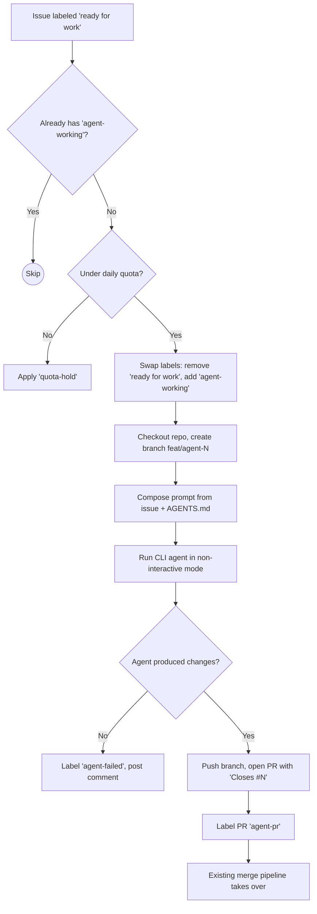

# Workflow: CLI Agent Issue Solver (Agent-Agnostic)

## Problem

Our issue lifecycle currently ends at the `ready for work` label. Issues are discovered by agents, published via `agent-issues.yml`, reviewed by Jules via `jules-issue-reviewer.yml`, and promoted to `ready for work` — but then they sit idle until a human or an externally-triggered agent picks them up.

We need a **new GitHub Actions workflow** that closes this loop: when an issue is labeled `ready for work`, a CLI-based AI agent checks out the repo, reads the issue, implements the solution on a feature branch, and opens a Pull Request — all autonomously.

## Goals

- **Agent-Agnostic**: The workflow should support pluggable CLI agents via a repository variable (e.g. `AGENT_CLI`). First-class target is [OpenCode](https://opencode.ai), but the design must accommodate alternatives like Claude Code, Aider, Codex CLI, etc.
- **Seamless Integration**: Plug directly into the existing label-driven state machine (`ready for work` → `agent-working` → PR opened).
- **Safe by Default**: The agent works in a feature branch, never touches `main` directly. Existing `auto-merge-staging.yml` and `hourly-merge-main.yml` handle promotion.
- **Quota-Aware**: Reuse the same daily-quota pattern from `jules-issue-reviewer.yml` (e.g. `AGENT_DAILY_TASKS` repo variable).

## Proposed Design

### Trigger
```yaml
on:
  issues:
    types: [labeled]
  workflow_dispatch:        # Manual sweep for retries
```

### Label Flow
```
ready for work  →  agent-working  →  (PR opened, label removed)
                    ↓ (on failure)
                  agent-failed
```

### High-Level Steps

1. **Gate**: Only fires when `ready for work` is applied. Skip if `agent-working` already present.
2. **Quota Check**: Count issues that received the `agent-working` label in the last 24h via timeline event auditing (same pattern as `jules-issue-reviewer.yml`). This ensures completed/failed attempts still count toward the quota. Respect `AGENT_DAILY_TASKS` limit.
3. **Label Swap**: Remove `ready for work`, apply `agent-working`.
4. **Checkout**: Clone repo, create branch `feat/agent-<number>` (compliant with `AGENTS.md` branch policy: `feat/*`, `fix/*`, `docs/*`).
5. **Compose Prompt**: Build a structured prompt from:
   - Issue title + body
   - `AGENTS.md` (repo conventions)
   - Any linked BDD `.feature` files referenced in the issue
6. **Run Agent**: Execute the configured CLI agent in non-interactive / headless mode:
   ```bash
   # OpenCode (primary target)
   opencode --non-interactive --prompt "$PROMPT"

   # Generic fallback pattern
   $AGENT_CLI $AGENT_CLI_FLAGS --prompt "$PROMPT"
   ```
7. **Commit & Push**: If the agent produced changes, push the feature branch.
8. **Open PR**: Create a PR targeting `main` with:
   - Title: `feat/agent-<issue-number>: <issue title>`
   - Body referencing `Closes #<number>`
   - Label: `agent-pr`
9. **Failure Handling**: If the agent exits non-zero or produces no diff:
   - Apply `agent-failed` label to the issue
   - Post a comment with the failure summary and logs
   - Do **not** open a PR

### Required Secrets / Variables

| Name | Type | Purpose |
|---|---|---|
| `AGENT_API_KEY` | Secret | API key for the LLM provider used by the agent |
| `AGENT_CLI` | Variable | CLI binary name (default: `opencode`) |
| `AGENT_CLI_FLAGS` | Variable | Extra flags passed to the agent CLI |
| `AGENT_DAILY_TASKS` | Variable | Max issues to attempt per 24h rolling window, counted via timeline event auditing (default: `5`) |
| `AGENT_MODEL` | Variable | Model identifier to pass to the agent (e.g. `claude-sonnet-4-20250514`) |

### New Labels

| Label | Color | Purpose |
|---|---|---|
| `agent-working` | `#1D76DB` | Agent is currently working on this issue |
| `agent-failed` | `#E11D48` | Agent attempted but failed to solve the issue |
| `agent-pr` | `#7C3AED` | PR was created by an agent |

> **Note:** The `quota-hold` label is reused from the existing `jules-issue-reviewer.yml` workflow and does not need to be created again.

## Design Considerations

### Why Agent-Agnostic?
CLI agents are evolving rapidly. Tying the workflow to one tool creates vendor lock-in. By parameterizing the binary and flags, swapping agents is a one-variable change — no workflow file edits needed.

### Security
- The agent runs inside a GitHub Actions runner with **no write access to `main`**. It can only push to feature branches.
- All agent PRs flow through the existing `auto-merge-staging.yml` → `hourly-merge-main.yml` pipeline, which runs the full test suite before merging.
- API keys are stored as GitHub Secrets, never exposed in logs.

### Prompt Engineering
The prompt composer step is critical. It should:
- Include the full issue body (acceptance criteria, BDD scenarios)
- Reference `AGENTS.md` for repo conventions (branch naming, atomic commits, no direct `main` pushes)
- Optionally include relevant file paths if the issue links to specific code areas
- Instruct the agent to run tests before committing

### Failure Modes
- **No diff produced**: Agent understood the issue but couldn't solve it → label `agent-failed`, comment with summary
- **Agent crash/timeout**: GHA job-level timeout (e.g. 30 min) → same failure handling
- **Tests fail**: Agent should run tests internally; if it pushes broken code, the staging pipeline catches it

## Acceptance Criteria

- [ ] New workflow file `.github/workflows/agent-issue-solver.yml`
- [ ] Workflow triggers on `ready for work` label and `workflow_dispatch`
- [ ] Agent-agnostic: CLI binary configurable via `AGENT_CLI` variable
- [ ] Quota enforcement matching the pattern in `jules-issue-reviewer.yml`
- [ ] Feature branch created per issue (`feat/agent-<number>`)
- [ ] PR opened with proper cross-reference (`Closes #N`)
- [ ] Failure handling with `agent-failed` label and diagnostic comment
- [ ] `docs/ci-cd.md` updated with new workflow documentation and mermaid diagram
- [ ] `AGENTS.md` updated if any new conventions are introduced
- [ ] No direct pushes to `main` — all changes flow through existing merge pipeline

## BDD Feature

```gherkin
Feature: CLI Agent Issue Solver Workflow

  Background:
    Given the repository has the "agent-issue-solver.yml" workflow enabled
    And the repository variable "AGENT_CLI" is set to "opencode"
    And the secret "AGENT_API_KEY" is configured
    And the repository variable "AGENT_DAILY_TASKS" is set to "5"

  Scenario: Agent picks up a ready-for-work issue
    Given an open issue #42 with label "ready for work"
    And the daily agent quota has not been reached
    When the "ready for work" label is applied to issue #42
    Then the workflow should remove the "ready for work" label
    And add the "agent-working" label to issue #42
    And create a branch "feat/agent-42"
    And invoke the CLI agent with the issue context as prompt
    And push the agent's changes to "feat/agent-42"
    And open a Pull Request referencing "Closes #42"
    And label the PR with "agent-pr"

  Scenario: Agent fails to solve the issue
    Given an open issue #43 with label "ready for work"
    And the CLI agent will exit with a non-zero code
    When the workflow processes issue #43
    Then the "agent-working" label should be removed
    And the "agent-failed" label should be applied
    And a comment should be posted with failure diagnostics
    And no Pull Request should be created

  Scenario: Daily quota is exhausted
    Given 5 issues have already been processed today
    And an open issue #44 with label "ready for work"
    When the workflow attempts to process issue #44
    Then issue #44 should retain the "ready for work" label
    And a "quota-hold" label should be applied
    And the issue should be retried in the next sweep

  Scenario: Workflow dispatch sweeps for retries
    Given issue #44 has labels "ready for work" and "quota-hold"
    And the daily agent quota has reset
    When the workflow is triggered via workflow_dispatch
    Then issue #44 should be processed normally
    And the "quota-hold" label should be removed

  Scenario: Agent produces no changes
    Given an open issue #45 with label "ready for work"
    And the CLI agent produces no file changes
    When the workflow processes issue #45
    Then the "agent-working" label should be removed
    And the "agent-failed" label should be applied
    And a comment should explain "No changes were produced"
    And no Pull Request should be created
```

## Mermaid: Proposed Flow


