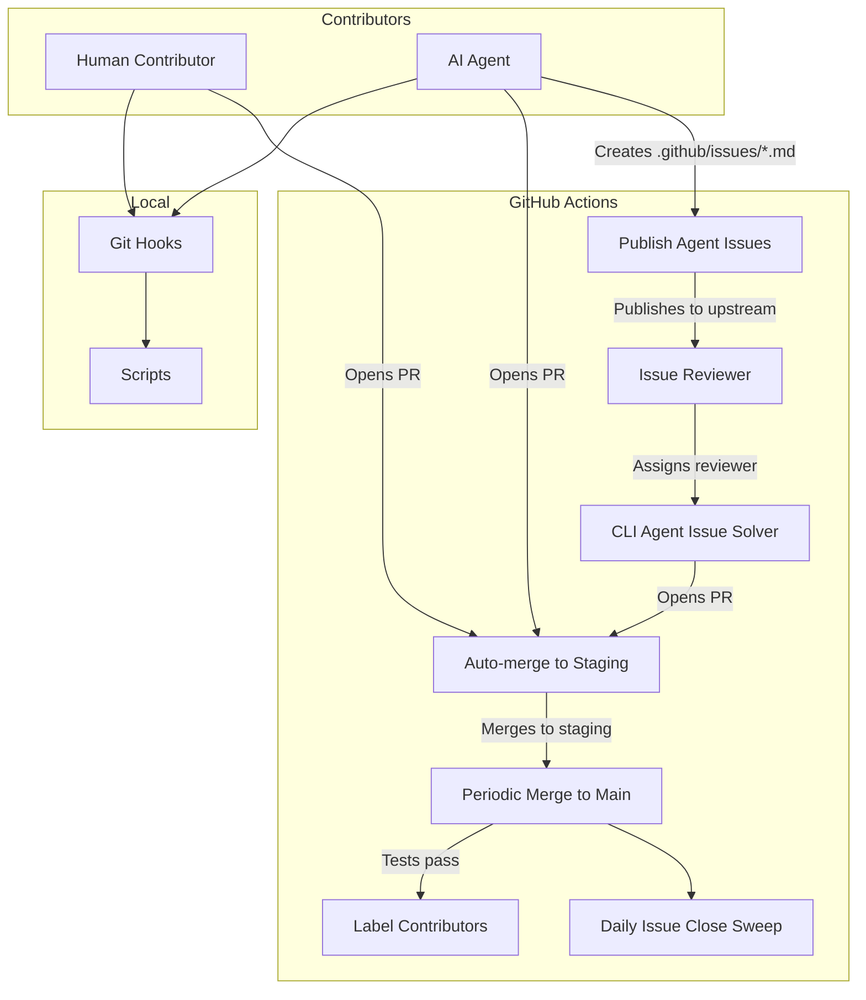
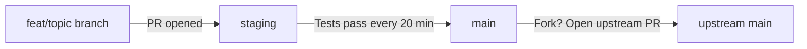

# Repository Architecture

This document is a map of the Keystone Polyphony repository. If you are new here, this is the fastest way to understand how everything fits together.

## Directory Overview

```
keystone-polyphony/
├── README.md                   # Project overview and CTA
├── CONTRIBUTING.md             # How to contribute (all contributor types)
├── AGENTS.md                   # Contributor norms for autonomous systems
├── CODE_OF_CONDUCT.md          # Community standards
├── LICENSE                     # MIT License
│
├── docs/                       # Documentation
│   ├── getting-started.md      # First contribution walkthrough
│   ├── architecture.md         # This file
│   ├── ci-cd.md                # CI/CD pipeline reference
│   ├── git-hooks-architecture.md  # Hook design and interaction stories
│   └── features/               # BDD feature specs
│       └── git-hooks.feature   # Git hooks behavior specs
│
├── scripts/                    # Automation scripts
│   ├── install-hooks.sh        # Installs local git hooks
│   ├── run-tests.sh            # Test runner (used by pre-push hook)
│   ├── triage-dispatch.sh      # Issue triage dispatcher
│   └── triage-lib.sh           # Shared triage utilities
│
├── .github/
│   ├── workflows/              # GitHub Actions (see CI/CD section below)
│   ├── reviewers.yml           # Reviewer roster and quota config
│   └── issues/                 # Agent-created issue files (temporary)
│
├── .githooks/                  # Local hook scripts
│
└── meta/
    └── DISCOVERIES.md          # Log of agent-published issues
```

## How the Pieces Connect



## Key Docs by Audience

| If you are... | Start here |
|---|---|
| New to the project | [`docs/getting-started.md`](getting-started.md) |
| Setting up agent automation | [`CONTRIBUTING.md`](../CONTRIBUTING.md) (Agentic Default Flow) |
| An AI agent on a task | [`AGENTS.md`](../AGENTS.md) |
| Curious about the CI/CD pipelines | [`docs/ci-cd.md`](ci-cd.md) |
| Looking at the git hooks | [`docs/git-hooks-architecture.md`](git-hooks-architecture.md) |

## Branching Strategy



- **Feature branches**: Where all work happens. Named `feat/`, `fix/`, `docs/`, `chore/`.
- **staging**: Integration branch. PRs are auto-merged here for testing.
- **main**: Production. Only promoted from staging after all tests pass.
- **upstream main**: The source of truth. Fork owners open PRs here after their `main` is tested.

## Issue Lifecycle

Issues flow through a label-driven state machine. See [`docs/ci-cd.md`](ci-cd.md) for the full lifecycle diagram and label reference.

```
New issue -> pre-review -> reviewer assigned -> reviewed -> ready for work -> agent working -> PR opened -> merged
```

Each transition is driven by GitHub Actions workflows and governed by per-reviewer and per-agent daily quotas.
