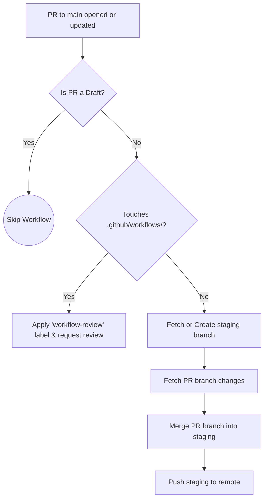
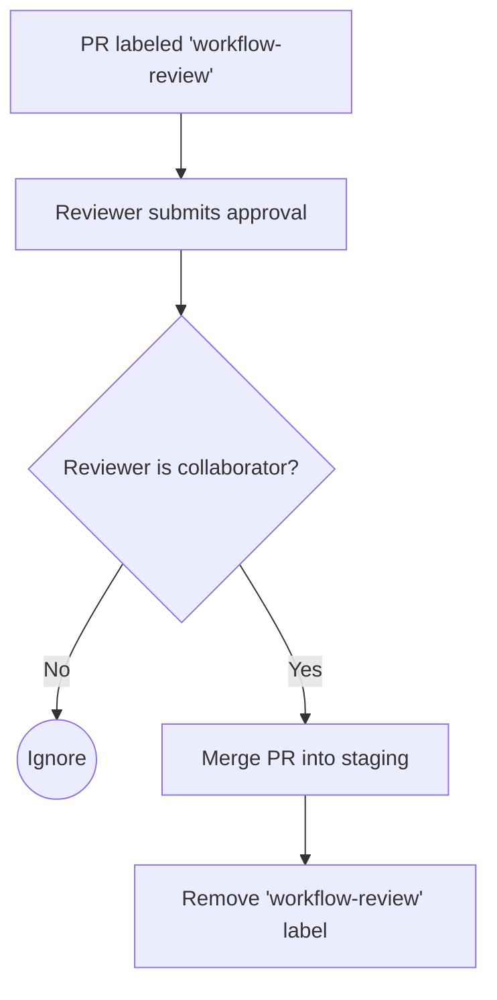
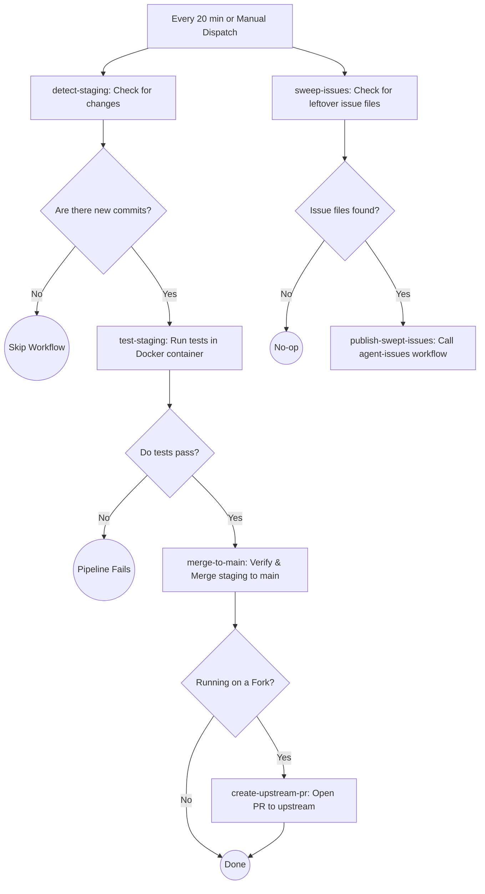
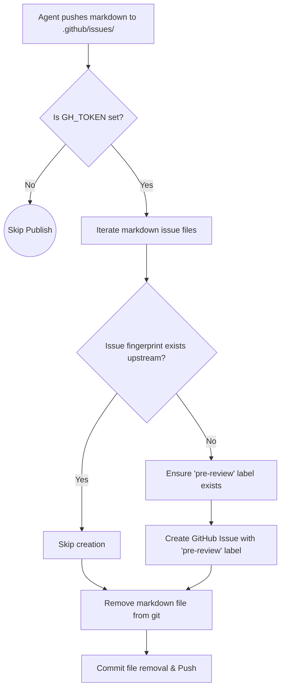
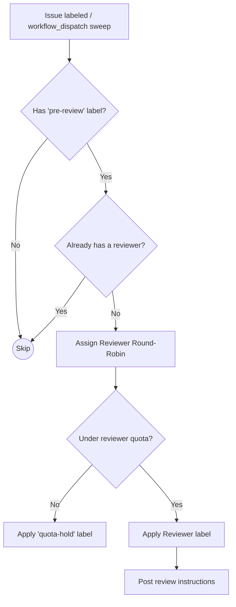
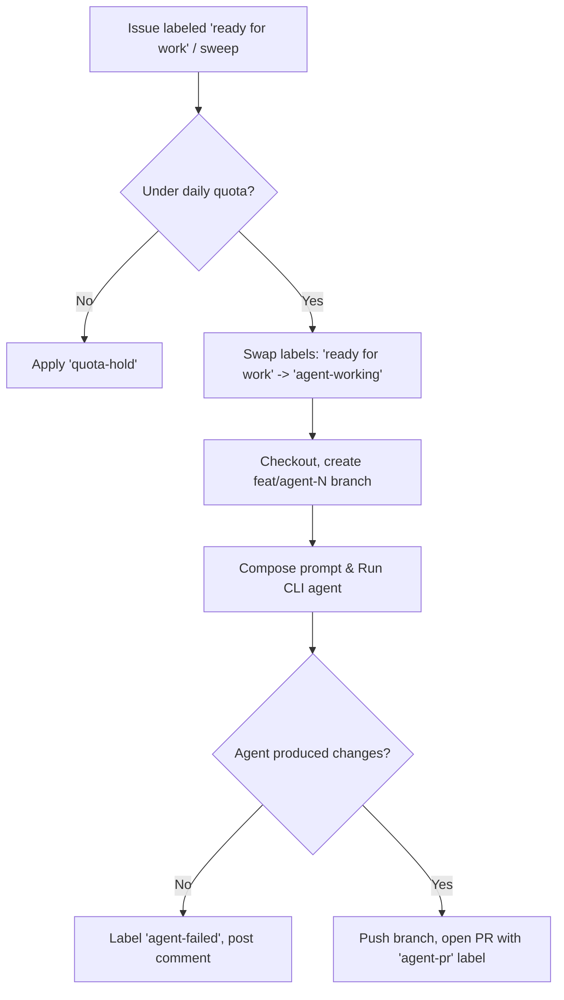
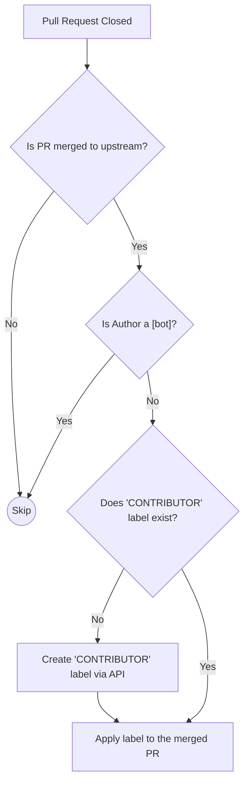
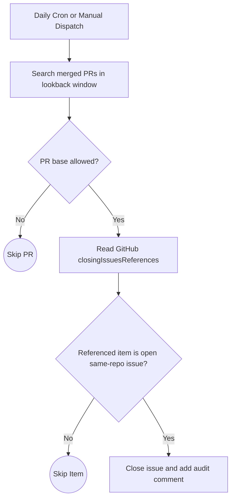
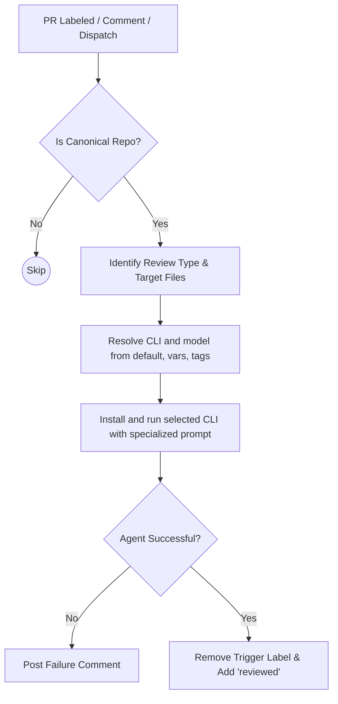
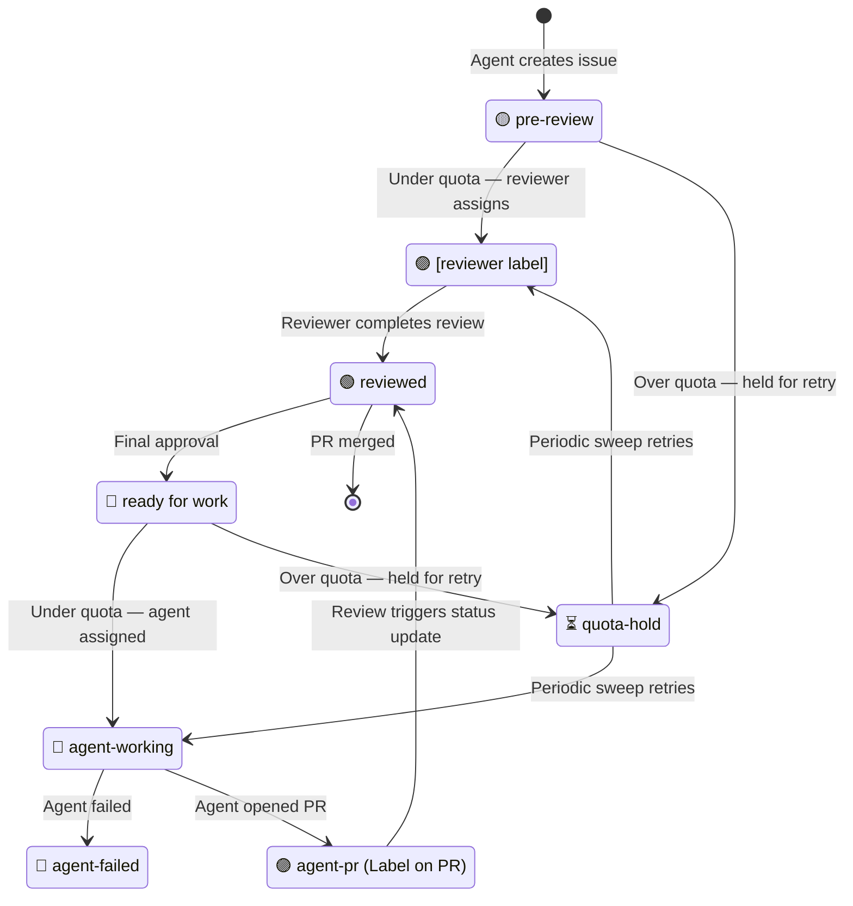

# Continuous Integration & Delivery (CI/CD)

This document outlines the automated pipelines that power the development lifecycle of this project. All automation is handled via GitHub Actions and can be found in the `[.github/workflows](../.github/workflows)` directory.

## Workflows Overview

### 1. Auto-merge PR to Staging
**Trigger:** `pull_request_target` (opened, synchronize, reopened, ready_for_review) against `main`.
**File:** `auto-merge-staging.yml`

This workflow enforces an "open-by-default" staging environment. Whenever a non-draft Pull Request is opened against the `main` branch, it is automatically merged into the `staging` branch — **unless** the PR modifies files in `.github/workflows/`, in which case it is held for review (see *Workflow File Protection*).

### 1b. Workflow File Protection
**Trigger:** `pull_request_review` (submitted) on PRs labeled `workflow-review`.
**File:** `workflow-review.yml`

PRs that modify `.github/workflows/` files have supply-chain security implications (arbitrary code execution, secret access). These PRs are not auto-merged; instead they receive a `workflow-review` label and a comment tagging configured reviewers. When a repository collaborator approves the PR review, this workflow merges the PR into staging.

### 2. Periodic Merge to Main
**Trigger:** `schedule` (every 20 minutes) or `workflow_dispatch`.
**File:** `periodic-merge-main.yml`

This scheduled job acts as the gatekeeper to production (`main`). It periodically checks the `staging` branch, runs all automated tests, and if everything passes cleanly, promotes staging into `main`. It also sweeps for any leftover issue files on `main` and publishes them.

### 3. Publish Agent Issues
**Trigger:** `push` modifying `.github/issues/*.md`, `workflow_call`, or `workflow_dispatch`.
**File:** `agent-issues.yml`

This workflow handles automated issue generation by AI agents. When markdown files are pushed to `.github/issues/`, this action parses them, translates them into actual GitHub Issues on the upstream repository, and applies the `pre-review` label to signal that the issue needs triage.

### 4. Issue Reviewer
**Trigger:** `issues` (labeled) or `workflow_dispatch`.
**File:** `issue-reviewer.yml`

When an issue is labeled with `pre-review`, this workflow assigns it to a reviewer (AI agent or human) defined in `.github/reviewers.yml`. It uses a round-robin strategy based on the issue number and checks per-reviewer rolling 24h quotas (defined as repository variables). Over-quota issues receive a `quota-hold` label and are retried automatically.

### 5. CLI Agent Issue Solver
**Trigger:** `issues` (labeled `ready for work`), `workflow_dispatch`.
**File:** `agent-issue-solver.yml`

This workflow autonomously implements solutions for issues marked as `ready for work`. It checks the `AGENT_DAILY_TASKS` quota, creates a feature branch, composes a prompt from the issue and repo context, and runs a pluggable CLI agent (e.g., OpenCode). If successful, it opens a Pull Request; otherwise, it labels the issue as `agent-failed`.

### 6. Label Contributors
**Trigger:** `pull_request` (closed).
**File:** `add-contributors.yml`

A community management workflow that ensures every contributor who successfully merges code gets recognized, human or otherwise. When a PR is merged, the author automatically receives the `CONTRIBUTOR` label. Currently, accounts ending in `[bot]` are skipped; this may be revisited as agent participation grows.

### 7. Daily Issue Close Sweep
**Trigger:** `schedule` (daily) or `workflow_dispatch`.
**File:** `daily-close-merged-issues.yml`

This workflow closes stale open issues that are already resolved by merged PRs when native GitHub auto-close did not fire. To prevent false positives, it only closes issues that appear in GitHub's own `closingIssuesReferences` for merged PRs, only for allowed base branches (`ISSUE_CLOSER_ALLOWED_BASE_REFS`, default: `main,staging`), only when the target is still an open issue in the same repository, and skips issues that were manually reopened after the PR merge.

### 8. Specialized AI PR Reviews (CLI)
**Trigger:** `issue_comment`, `pull_request_review_comment`, `pull_request` (labeled), `workflow_dispatch`.
**File:** `opencode.yml`

This workflow provides targeted AI analysis on Pull Requests using a pluggable CLI runner. It can be triggered manually via `/oc` commands or automatically by adding labels like `workflow-review`, `arch-review`, or `security-review`. The workflow identifies changed files relevant to the review type, posts a guiding comment, runs the selected CLI directly, and posts the CLI output back to the PR.

CLI selection precedence is:
1. Default (`opencode`)
2. Repository variable (`REVIEW_AGENT_CLI`, then fallback `AGENT_CLI`)
3. PR label tag (`review-cli:<cli>` or `review-agent:<cli>`)

Model override uses the same pattern (`DEFAULT -> REVIEW_AGENT_MODEL/AGENT_MODEL -> review-model:<model>`). For custom tooling, install and argument behavior can be customized with repository variables such as `REVIEW_AGENT_INSTALL_CMD`, `REVIEW_AGENT_CLI_FLAGS`, `REVIEW_AGENT_MODEL_FLAG`, `REVIEW_AGENT_PROMPT_FLAG`, and `REVIEW_AGENT_PROMPT_MODE`.

Security hardening notes:
- `/oc` and `/opencode` comment-triggered reviews only run for trusted associations (`OWNER`, `MEMBER`, `COLLABORATOR`).
- Default CLI installs are version-pinned, with package override variables (`REVIEW_OPENCODE_NPM_PACKAGE`, `REVIEW_OPENCLAW_NPM_PACKAGE`, `REVIEW_CLAUDE_NPM_PACKAGE`).
- Only the provider-specific API key for the selected model is injected into the CLI environment.

Public repository policy (risk classification):
- This repository does not use confidential secrets in code, repository variables, or GitHub Actions secrets.
- Reviewers should classify generic token plumbing as **best-practice hygiene** by default.
- Escalate to **high severity / no-go** only when there is concrete evidence of real sensitive data exposure, privilege escalation, or malicious behavior.

---

## Issue Lifecycle

All agent-generated issues follow a label-driven state machine. Labels are created automatically by workflows if they do not already exist. Issue throughput is governed by repository variables (rolling 24h window), with variable names defined per-reviewer in `.github/reviewers.yml`, and the `AGENT_DAILY_TASKS` variable for implementing agents.

