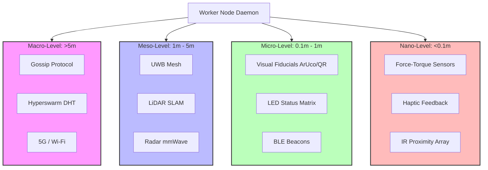

# Sensory Architecture Diagram

## 1. Overview
This diagram represents the sensory modalities and their operational ranges for the Keystone Polyphony worker node.

## 2. Attenuation Logic
- **Default State:** Global sync via Macro-level Gossip.
- **Proximity Trigger:** Activate UWB/LiDAR when peers are within 5m.
- **Precision Trigger:** Activate Visual tracking for tandem alignment under 1m.
- **Safety Trigger:** Activate IR Proximity for collision avoidance.
